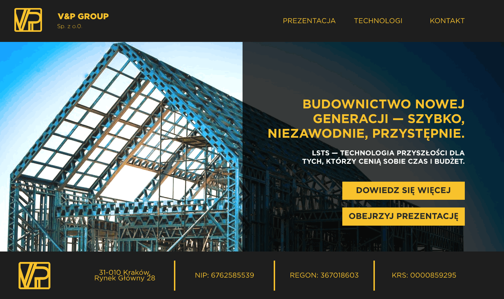
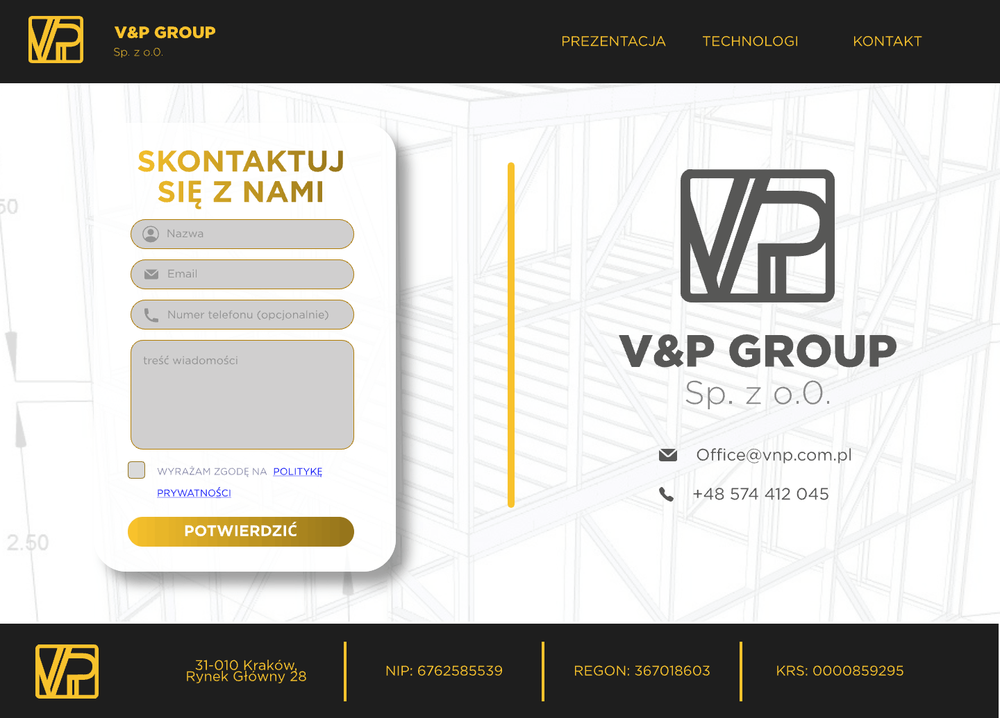
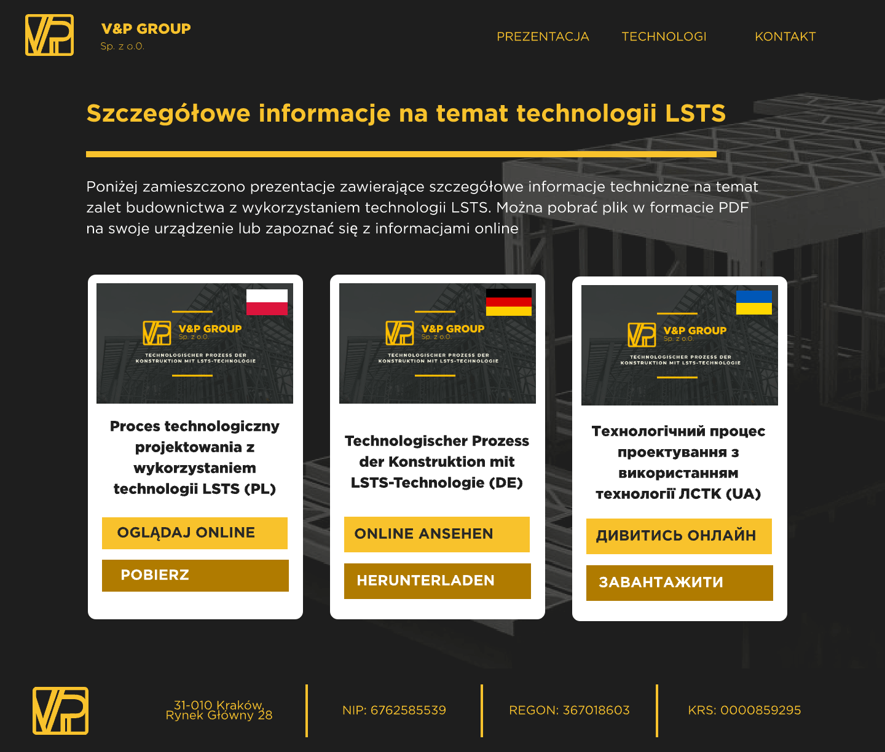

# 🌐 VP Group — Corporate Website

   

> Комерційний проєкт для польського клієнта. Вихідний код закритий за умовами конфіденційності.

## Про проєкт
Розробка сайту-візитки та лендингу для компанії V&P Group (Польща): від дизайну лендингу до інтеграції форми зворотного зв'язку.

## Функціонал
- Лендинг-сторінка (HTML/CSS/JS) з адаптивною версткою
- Django-бекенд з формою зворотного зв'язку
- JS-валідація форм на клієнті
- Автоматична пересилка заявок з форми в Telegram через IMAP-скрипт
- Розгортання на cPanel/HostIQ

## Стек

- `Django` — бекенд і логіка роботи контактної форми
- `HTML/CSS/JS` — розмітка та інтерактивність лендингу
- `IMAP` — скрипт для автоматичного пересилання електронних листів у Telegram
- `cPanel` — розгортання та хостинг

## Скріншоти

🔗 [Живий сайт](https://vnp.com.pl)
